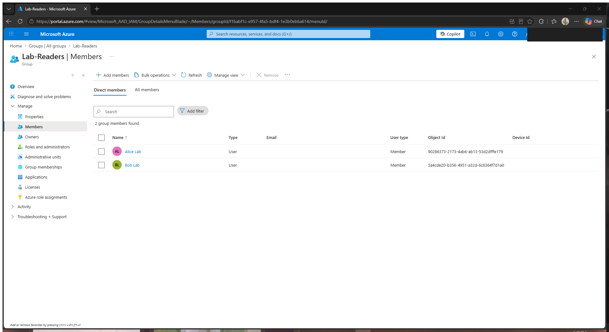
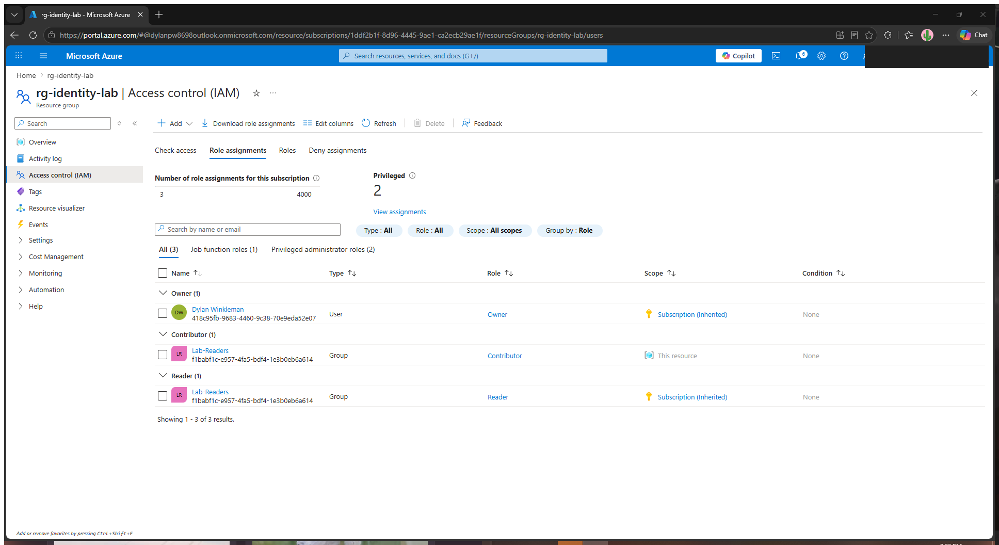
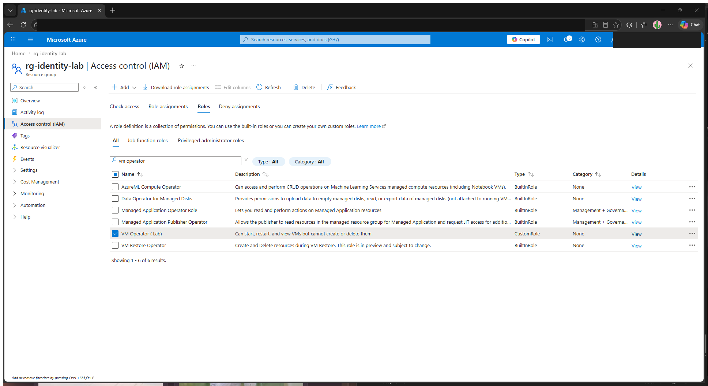
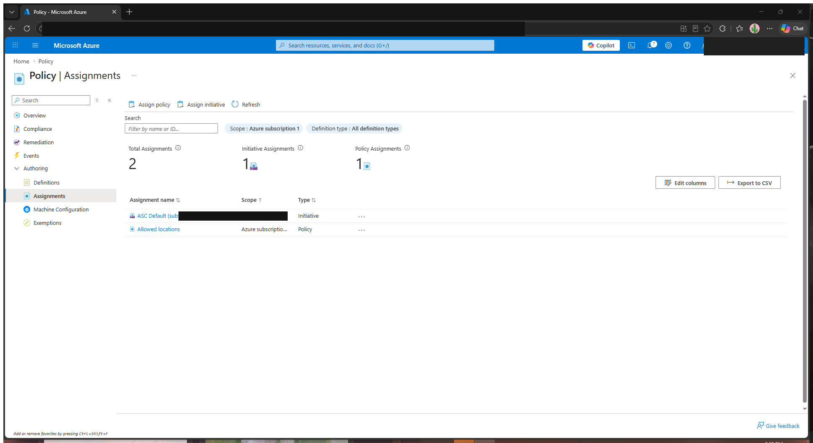
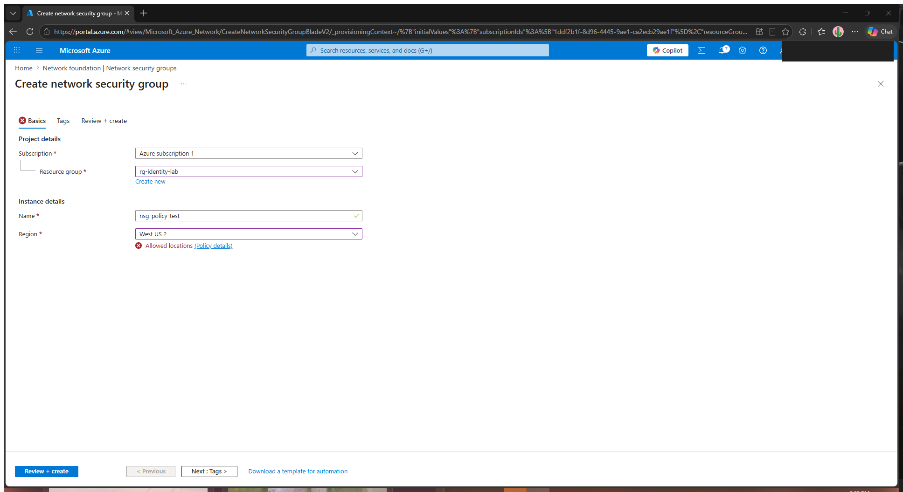
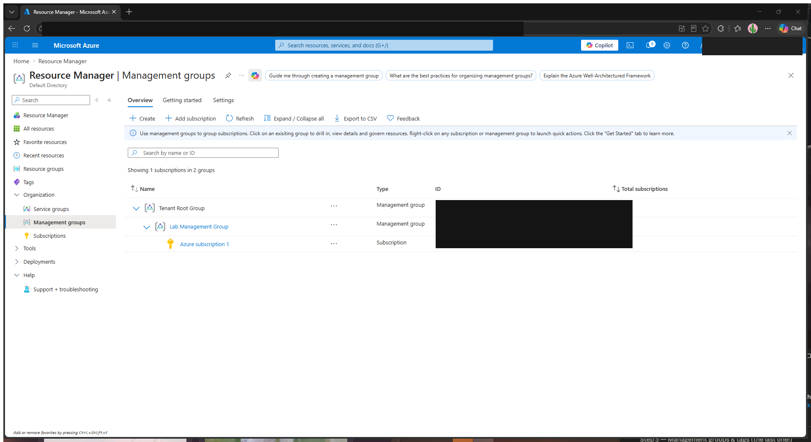

# Azure Identity & RBAC Lab

> Hands-on lab demonstrating identity and access management in Microsoft Azure:
> Entra ID users & groups, built-in and custom RBAC roles, Azure Policy, and
> organization with management groups and tags.
>
> Maps to the **AZ-104 — Identity & Governance** exam domain (15–20%).


---

## 🎯 What this lab demonstrates

The ability to control **who can do what** in an Azure environment:

- Provisioning identities (users) and grouping them for scalable access management
- Granting least-privilege access with **built-in RBAC roles** at the right scope
- Authoring a **custom RBAC role** with a narrow, purpose-built permission set
- Enforcing organizational guardrails with **Azure Policy**
- Structuring resources for governance using **management groups** and **tags**

## 🧰 Azure services used

Microsoft Entra ID · Azure RBAC · Custom Roles · Azure Policy · Management Groups · Resource Tags

---

## 📋 Build log

> Fill each section in as you complete it. Drop screenshots in `screenshots/` and
> reference them inline. The goal is that someone reading this repo can see *exactly*
> what you did and that it works.

### 1. Entra ID users & groups
**What I did:**
- Created 2 Entra ID users — `alice@…onmicrosoft.com` (Alice Lab) and `bob@…onmicrosoft.com` (Bob Lab)
- Created a **Security** group `lab-readers` (membership type: Assigned) and added both users

**Why it matters:** assigning access to *groups* instead of individual users is the scalable, real-world pattern.

```bash
# See scripts/01-users-and-groups.sh for the CLI version
```



---

### 2. Built-in RBAC role assignments
**What I did:**
- Assigned **Reader** to `lab-readers` at **subscription** scope (broad, read-only)
- Assigned **Contributor** to `lab-readers` at the **`rg-identity-lab`** resource-group scope (write, but only in that RG)

**Key concept:** *role assignment = security principal + role definition + scope.* Scope inherits downward (management group → subscription → resource group → resource). The screenshot shows this clearly: at the resource group, `lab-readers` has **Contributor (This resource)** *and* an inherited **Reader (Subscription)** — least privilege in action.



---

### 3. Custom RBAC role
**What I did:**
- Authored a custom role **`VM Operator (Lab)`** (started from scratch) granting only:
  - `Microsoft.Compute/virtualMachines/read`
  - `Microsoft.Compute/virtualMachines/start/action`
  - `Microsoft.Compute/virtualMachines/restart/action`
- Deliberately **omitted** `write`/`delete` — operators can keep VMs running but can't create or tear them down
- Assignable scope: `rg-identity-lab`

See [`custom-roles/vm-operator.json`](custom-roles/vm-operator.json) for the role definition JSON.



---

### 4. Azure Policy
**What I did:**
- Assigned the built-in **Allowed locations** policy, restricting resources to **East US**
- Verified enforcement by attempting to create a Network Security Group in **West US 2** inside `rg-identity-lab` — Azure **denied** it at validation time, flagging the Region field with the *Allowed locations* policy

**Key concept:** Policy uses a **Deny** effect that blocks non-compliant resources *at creation*, not just reports them afterward — a real governance guardrail for cost control and data residency.



The denial in action — a valid name but a disallowed region is rejected by policy:



---

### 5. Management groups & tags
**What I did:**
- Created management group `<name>` and placed the subscription under it
- Applied tags (`env=lab`, `owner=dylan`, `costcenter=…`) for organization/cost tracking



---

## 🧹 Cleanup (cost discipline)

```bash
# Remove role assignments, policy assignment, custom role, users/groups, and the lab RG
# See scripts/99-cleanup.sh
```

> Always tear down lab resources when finished to avoid charges.

---

## 🔗 Related

- AZ-104 study tracker (Obsidian) — Identity & Governance domain
- Companion labs: `azure-vm-networking-lab`, `azure-storage-sas-lab`, `azure-dns-static-web-app-lab`

## 📝 Résumé bullet

> Built an Azure identity & access-management lab: provisioned Entra ID users/groups,
> applied least-privilege access with built-in and **custom RBAC roles** scoped per
> resource group, and enforced governance guardrails with **Azure Policy**,
> management groups, and tagging.
